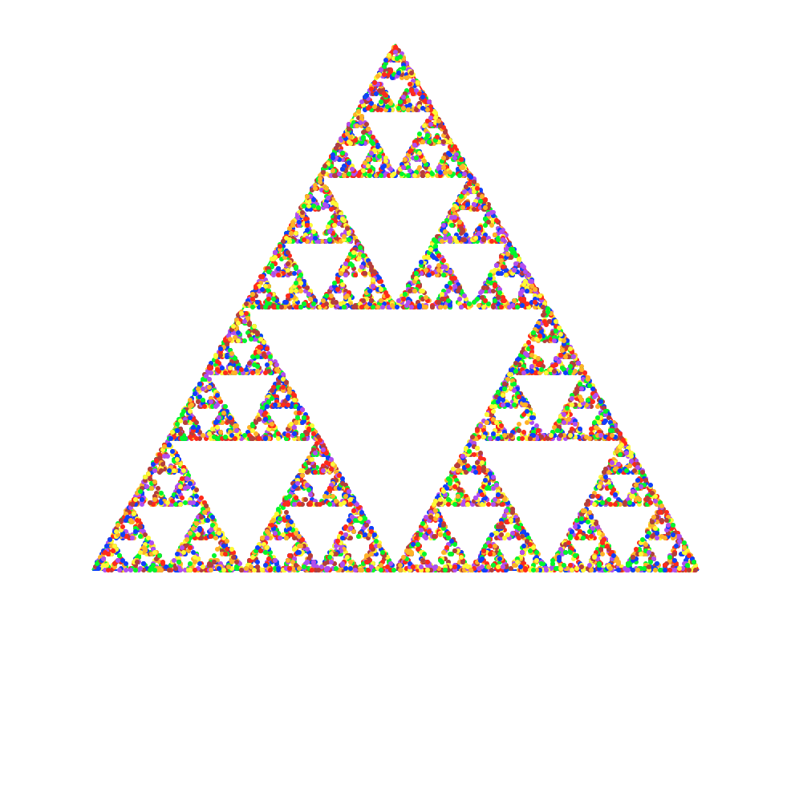
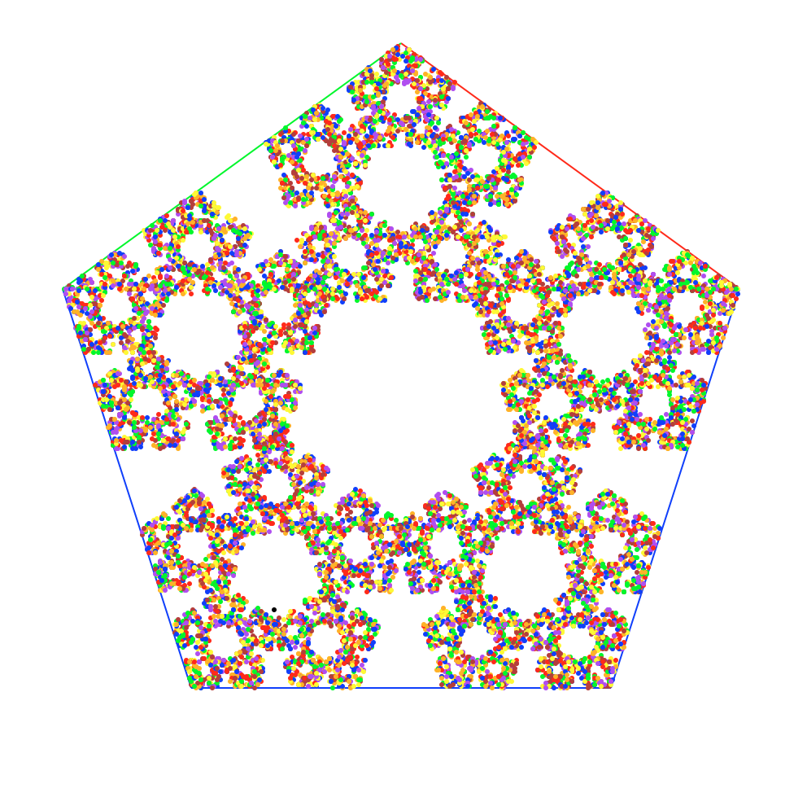
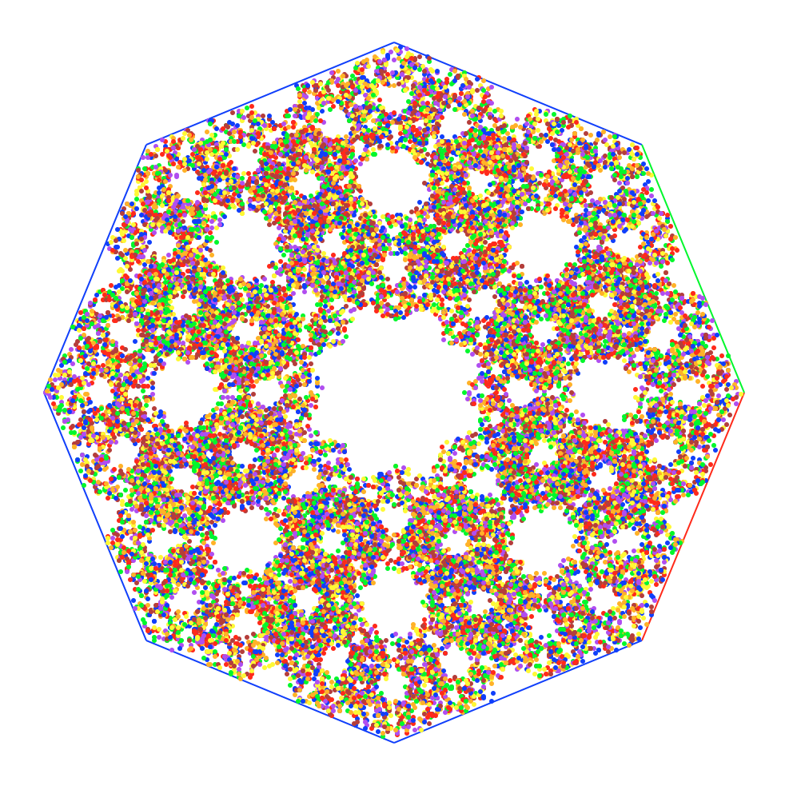

### The Chaos Game
The Basic Rules:

	Take a regular polygon and a random point starting inside the polygon. Randomly select 
	one vertex and move towards it. Changing the rate at which the random point approaches 
	each vertex will change the look of the final image. Some polygon and rate 
	combination's just end up generating noise, but others turn into spectacular works of 
	art.  For inspiration, check out the following examples

A triangle, where the point moved 1/2 the distance to each randomly selected vertex

A pentagon, where the point moved 3/5 the distance to each randomly selected vertex

An Octagon, where the point moved 3/5 the distance to each randomly selected vertex

As things currently stand, in order to change the shape of the polygon or rate at which
the point approaches each vertex, changes need to be made directly to the code. In order
to change the shape, adjust the final argument for the self.shape attribute in the Board
class' __init__ method to be any integer greater than 1. Similarly, to change the rate,
make adjustments to the self.scale attribute in the Board class' __init__ method.
self.scale should be a fraction, but feel free to experiment. After the menu is finished
changes wont need to be hard coded.

